# log-analysis
## 实现功能
**1. 注册**
- 输入用户名、密码、电子邮箱等必要信息，并点击注册按钮将信息提交至数据库。最后一行可以选择运维人员还是系统管理员。

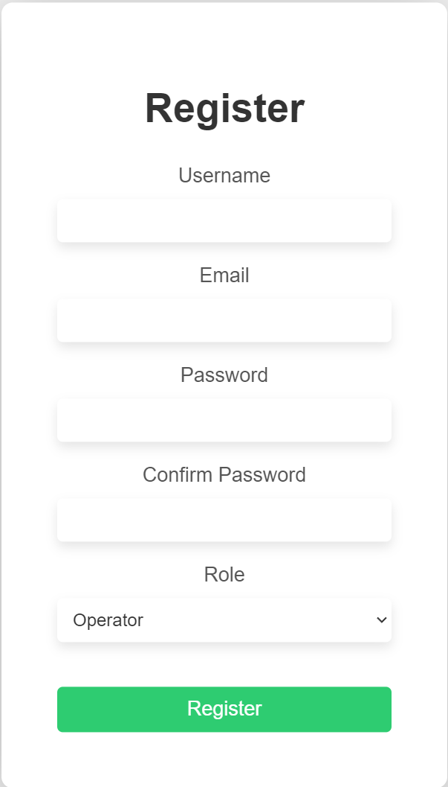

- 如果是系统管理员需要填写验证码，验证码为自定义（123456或654321）

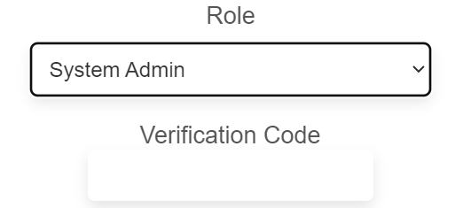

- 各部分填写要求实时显示，满足要求后不再显示
    - 用户名
  
    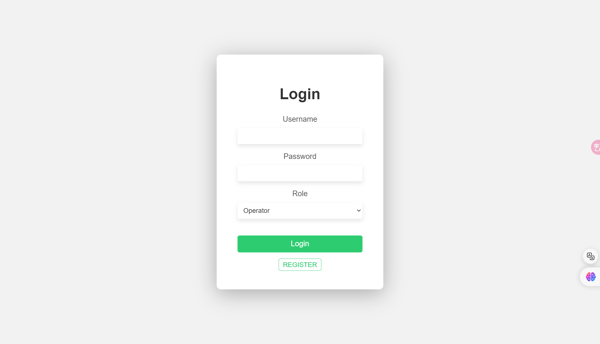

    - 密码
     
    

    - 重输入密码
     
    

- 后端检测 前端警告
    - 用户名检测
     
    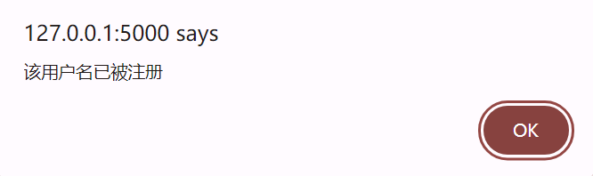

    - 邮箱检测
     
    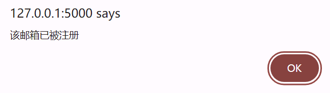

    - 系统管理员验证码检测
     
    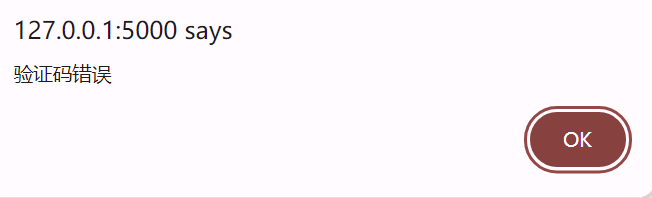

**2. 登录**
- 用户访问登录页面，输入已注册的用户名和密码，选择是运维人员还是系统管理员，并点击登录按钮。
 
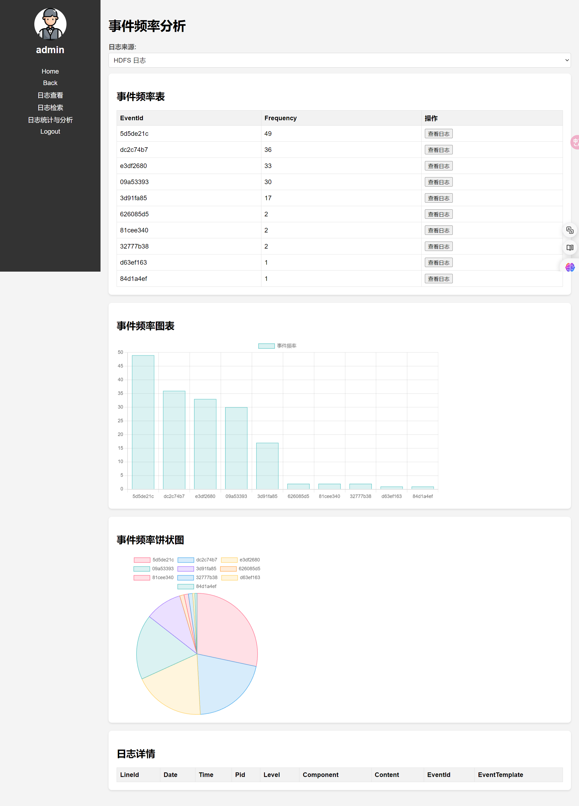

- 如果用户名和密码匹配失败，系统提示用户重新输入用户名和密码。
 
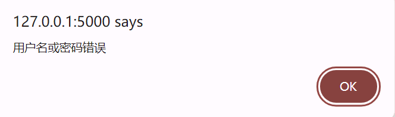

- 运维人员用户名和密码匹配成功进入operator_mainpage
- 系统管理员用户名和密码匹配成功进入admin_mainpage(增加人员管理部分)

**3. 系统管理员人员管理**

- 查看运维人员
 
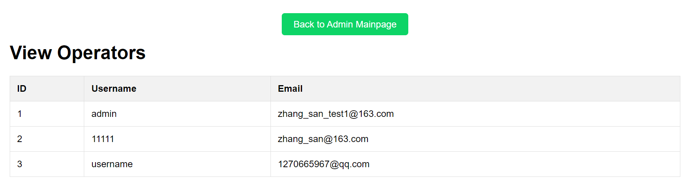

- 添加运维人员
 
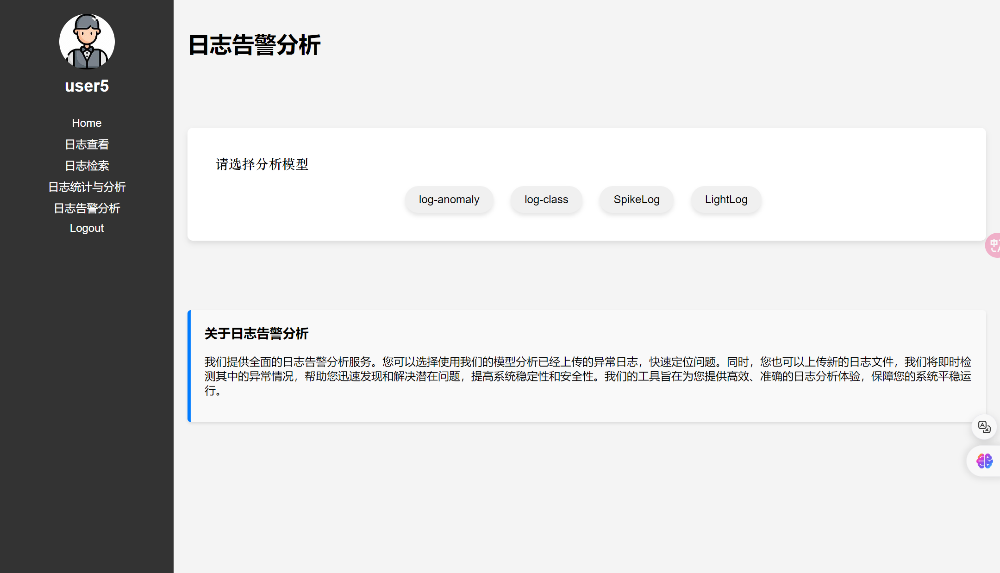

添加后自动跳转到查看运维人员

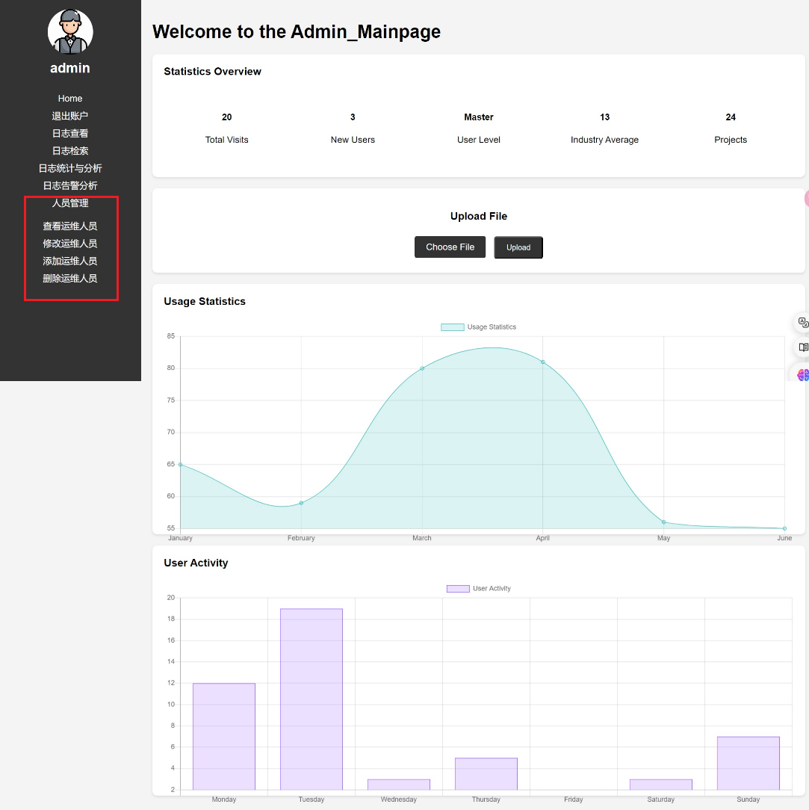

- 删除运维人员
 
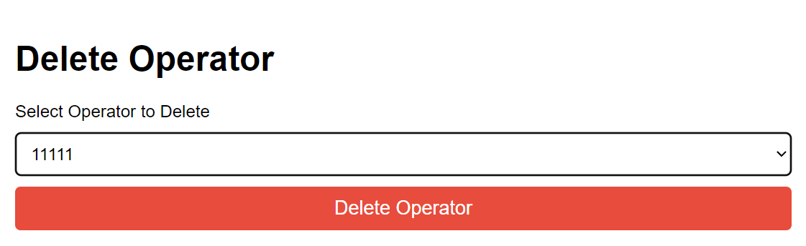

删除后自动跳转到查看运维人员

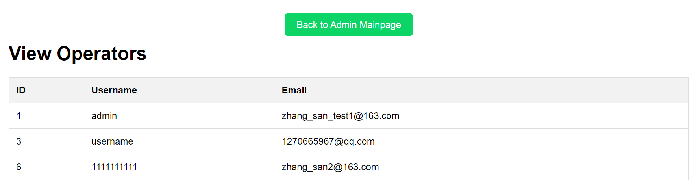
