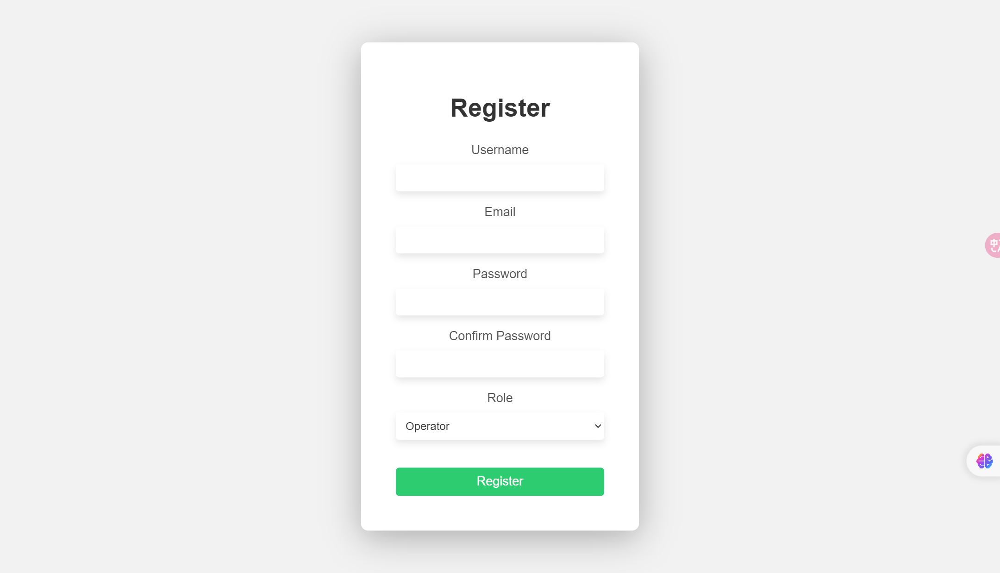
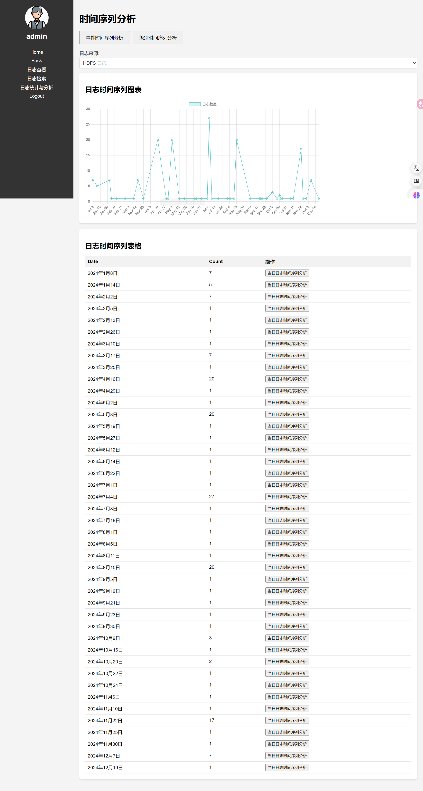

# 安装说明

为了确保用户能够在本地成功搭建和运行开发环境，请按照以下步骤进行操作。项目代码网址为[GitHub - Xujijun123/log-analysis](https://github.com/Xujijun123/log-analysis)。

## 操作系统

Ubuntu 20.04 LTS / Windows 10 / macOS 10.15 及以上版本。

## 安装基础软件

安装Python 3.8及以上版本。从[Python官网](https://www.python.org/)下载并安装Python。验证安装使用：

```
python --version
python3 --version
```

## 设置虚拟环境（可选）

在项目目录中创建虚拟环境并激活：

```bash
python -m venv venv
venv\Scripts\activate
```

## 安装项目依赖

从requirements.txt文件中安装依赖，运行下面的命令：

```bash
pip install -r requirements.txt
```

## 数据库配置

安装并配置MySQL数据库。可以从[MySQL官网](https://dev.mysql.com/downloads/mysql/)下载并安装MySQL。

启动MySQL服务并创建项目数据库：

```sql
CREATE DATABASE logdatabase;
```

配置数据库用户并授予权限：

```sql
CREATE USER 'root'@'localhost' IDENTIFIED BY 'YOUR_NAME';
GRANT ALL PRIVILEGES ON logdatabase.* TO 'root'@'localhost';
FLUSH PRIVILEGES;
```

根据项目需求，创建必要的数据库表：

```sql
CREATE TABLE IF NOT EXISTS operator (
    id INT AUTO_INCREMENT PRIMARY KEY,
    username VARCHAR(50) NOT NULL,
    password VARCHAR(50) NOT NULL,
    email VARCHAR(100),
    注销状况 BOOLEAN
);

CREATE TABLE IF NOT EXISTS systemadmins (
    id INT AUTO_INCREMENT PRIMARY KEY,
    username VARCHAR(50) NOT NULL,
    password VARCHAR(50) NOT NULL,
    email VARCHAR(100),
    code VARCHAR(50),
    注销状况 BOOLEAN
);

CREATE TABLE IF NOT EXISTS hdfs_structured (
    LineId INT,
    Date DATE,
    Time TIME,
    Pid INT,
    Level VARCHAR(10),
    Component VARCHAR(50),
    Content TEXT,
    EventId VARCHAR(50),
    EventTemplate VARCHAR(255)
);
```

## 配置文件上传目录

创建用于文件上传的目录：

```bash
mkdir -p uploads
```

## 运行Flask应用

在项目根目录下，运行Flask应用：

```bash
python main.py
```

## 访问应用

在浏览器中访问 [http://127.0.0.1:5000](http://127.0.0.1:5000)，确保应用正确运行。

# 使用方法

1. 进入网站首页

  
2. 注册：点击首页上的Register按钮，进入下面的页面，输入注册用户的用户名，邮箱，密码等信息，注意已注册过的用户名和邮箱不能重新注册。在最下方选择注册用户是运维人员（Operator）还是系统管理员（System Admin），如果选择系统管理员则需要输入验证码，验证码请联系开发人员获取。

  
1. 登录：请输入已经注册的用户名，密码并选择角色。

  
2. 运维人员进入运维页面，系统管理员进入管理页面。
  

### 运维页面
.png)
1. 主页面包含一个日志上传的按钮，上传之后可以点击左侧的按钮执行日志查看，日志检索，日志统计分析操作。
.png)

2. 上传后查看日志示例：
.png)

1. 日志检索示例如下，可以根据日志数据库中相关信息进行检索：
.png) 

2. 事件频率分析示例如下，根据每个事件发生的频率进行统计，绘制柱状图和饼状图。
 

1. 时间序列分析示例如下，以每天为单位进行统计并绘制折线图。
 

1. 在日志告警分析部分可以选择模型并上传文件。


### 管理页面

在运维的基础上增加人员管理部分，点击左侧的人员管理部分实现运维人员的增删改查操作。
 